Yossef CS218 2/26/2026 Assignment 2 - Serverless Order API

my github for this assignment - https://github.com/Yossefgit/CS218Assignment2Yossef

EC2 type: t3.micro ubuntu
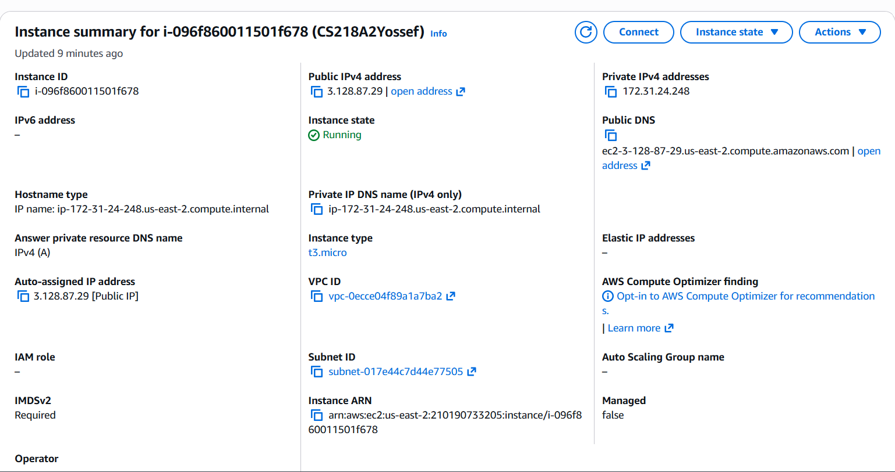

Security rules and port configuration:
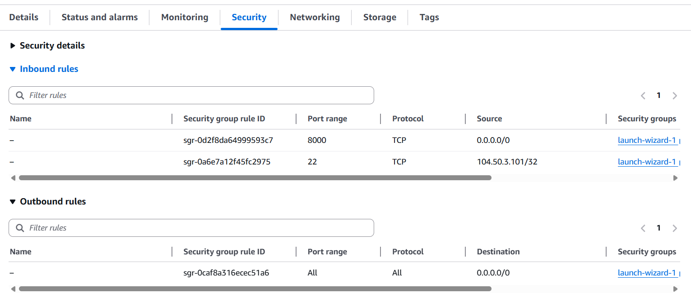
uvicorn main:app --host 0.0.0.0 --port 8000 to run the server

steps to run:

pre req:

    EC2 needs to be running
    Key needs to exist in .ssh file
    need to have the github code
    Python for the code language, SQLite for the database, and fastAPI for the endpoints
    2 terminals open

connecting and setting up the server enviorment assuming it's a blank new instance 

a run:
ssh -i C:\Users\water\.ssh\A2KEY.pem ubuntu@3.128.87.29

the path will vary but basically need to use the key in the SSH file and use it to access the EC2

b installing the dependencies python and sqlite by running:

sudo apt install -y python3-venv python3-pip git sqlite3

c cloning the github link on it:
git clone https://github.com/Yossefgit/CS218Assignment2Yossef.git
and going into it:
cd CS218Assignment2Yossef

d creating the enviorment:
python3 -m venv .venv
source .venv/bin/activate

e installing the fastAPI dependency:
pip install fastapi uvicorn

f starting the server we run:
uvicorn main:app --host 0.0.0.0 --port 8000
should get:
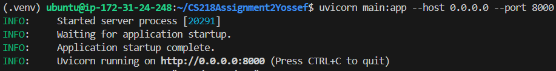

IN A SEPERATE TERMINAL FOR ALL THE NEXT COMMANDS:
we run
Invoke-RestMethod -Method Get -Uri "http://3.128.87.29:8000/" 
to see if the server is running. if it runs it returns the message server running in the terminal we typed the command in
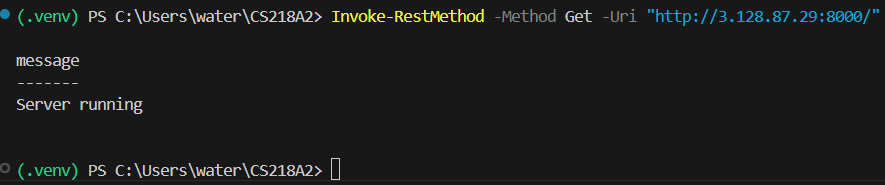
and in the previous terminal it should return "200 OK"

STEP 1
Invoke-RestMethod `
-Method Post `
-Uri "http://3.128.87.29:8000/orders" `
-Headers @{ "Idempotency-Key" = "test-123" } `
-ContentType "application/json" `
-Body '{"customer_id":"cust1","item_id":"item1","quantity":1}'

we get HTTP of 201 and the JSON response containing the order_id and status created

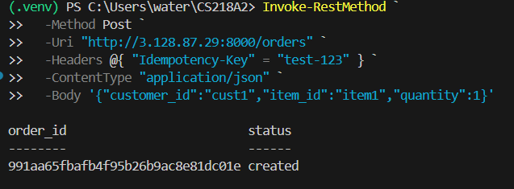

STEP 2

Invoke-RestMethod `
-Method Post `
-Uri "http://3.128.87.29:8000/orders" `
-Headers @{ "Idempotency-Key" = "test-123" } `
-ContentType "application/json" `
-Body '{"customer_id":"cust1","item_id":"item1","quantity":1}'

we get the exact same information as step 1

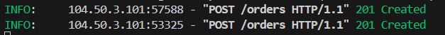
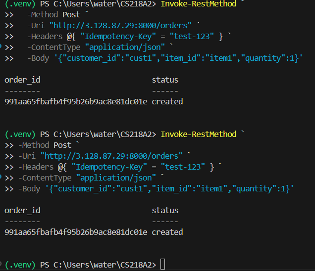

STEP 3

  proving theres no DB modifications we run this before and after step 3:

  sqlite3 app.db "SELECT idempotency_key, request_hash, status_code, created_at FROM idempotency_records WHERE idempotency_key='test-123';"
  sqlite3 app.db "SELECT response_body FROM idempotency_records WHERE idempotency_key='test-123';"

Invoke-RestMethod `
  -Method Post `
  -Uri "http://3.128.87.29:8000/orders" `
  -Headers @{ "Idempotency-Key" = "test-123" } `
  -ContentType "application/json" `
  -Body '{"customer_id":"cust1","item_id":"item1","quantity":5}'

  correct outputs the HTTP 409 error

  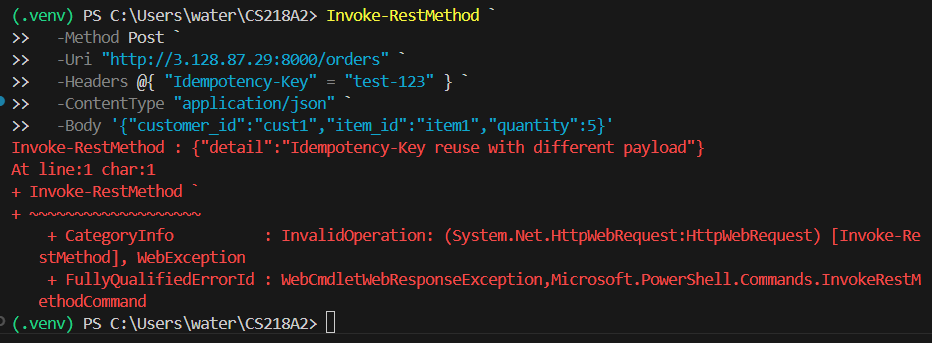
  

STEP 4

Invoke-RestMethod `
  -Method Post `
  -Uri "http://3.128.87.29:8000/orders" `
  -Headers @{
    "Idempotency-Key" = "test-fail-1"
    "X-Debug-Fail-After-Commit" = "true"
  } `
  -ContentType "application/json" `
  -Body '{"customer_id":"cust2","item_id":"item2","quantity":1}'

  we get HTTP error 500 like expected
  
  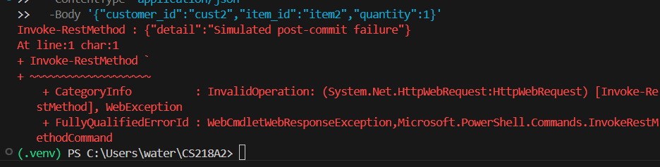

  to show proof that the server has already commited the writes before the failure
  we run:

  sqlite3 app.db "SELECT idempotency_key, status_code, created_at FROM idempotency_records WHERE idempotency_key='test-fail-1';"
  sqlite3 app.db "SELECT response_body FROM idempotency_records WHERE idempotency_key='test-fail-1';"

 using the order id recieved
 sqlite3 app.db "SELECT COUNT(*) AS orders_for_fail FROM orders WHERE order_id='
 ';"
 sqlite3 app.db "SELECT COUNT(*) AS ledger_for_fail FROM ledger WHERE order_id='
 ';"

should get 1 1 
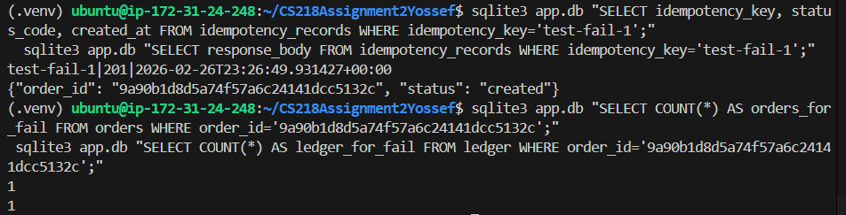

 STEP 5

 Invoke-RestMethod `
  -Method Post `
  -Uri "http://3.128.87.29:8000/orders" `
  -Headers @{ "Idempotency-Key" = "test-fail-1" } `
  -ContentType "application/json" `
  -Body '{"customer_id":"cust2","item_id":"item2","quantity":1}'

  expected behavior of HTTP 201 and valid order id:
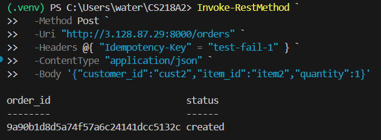

  To show that theres still only one order and one ledger entry exists we run these and we use the order fail value from step 4 here
  sqlite3 app.db "SELECT COUNT(*) FROM orders WHERE order_id='
  ';"
  sqlite3 app.db "SELECT COUNT(*) FROM ledger WHERE order_id='
  ';"
supposed to get 1 1 again to show that theres still only one ledger and one order entries that exist

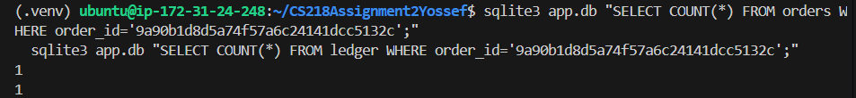

  STEP 6
  we run with the order id from step 1 and it showes that the order is retireveable 
  Invoke-RestMethod -Method Get -Uri "http://3.128.87.29:8000/orders/
  "
  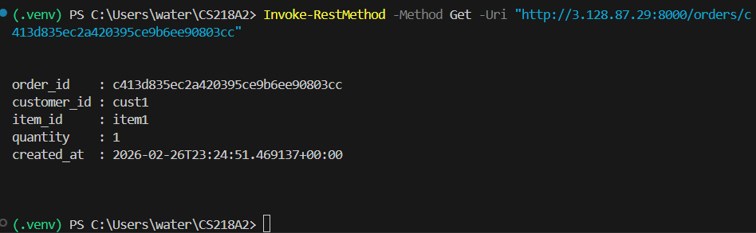
  

  run with step 4 order id to show that only one order exists for that key
  Invoke-RestMethod -Method Get -Uri "http://3.128.87.29:8000/orders/
  "
  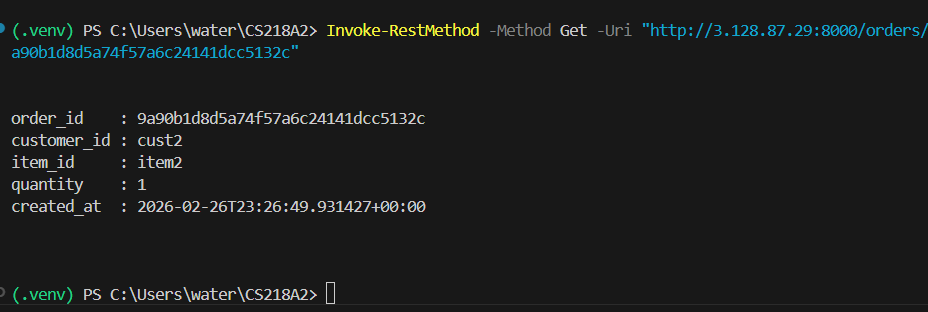
  